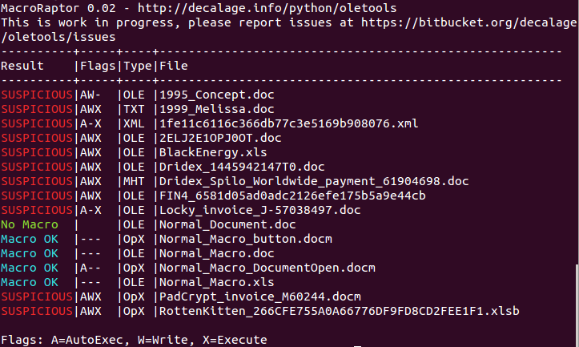

mraptor (MacroRaptor)
=====================

mraptor is a tool designed to detect most malicious VBA Macros using
generic heuristics. Unlike antivirus engines, it does not rely on signatures.

In a nutshell, mraptor detects keywords corresponding to the three
following types of behaviour that are present in clear text in almost
any macro malware:
- A: Auto-execution trigger
- W: Write to the file system or memory
- X: Execute a file or any payload outside the VBA context

mraptor considers that a macro is suspicious when A and (W or X) is true.

For more information about mraptor's detection algorithm, see the article
[How to detect most malicious macros without an antivirus](http://www.decalage.info/mraptor).

mraptor can be used either as a command-line tool, or as a python module
from your own applications.

It is part of the [python-oletools](http://www.decalage.info/python/oletools) package.

## Usage

```text
Usage: mraptor [options] <filename> [filename2 ...]

Options:
  -h, --help            show this help message and exit
  -r                    find files recursively in subdirectories.
  -z ZIP_PASSWORD, --zip=ZIP_PASSWORD
                        if the file is a zip archive, open all files from it,
                        using the provided password (requires Python 2.6+)
  -f ZIP_FNAME, --zipfname=ZIP_FNAME
                        if the file is a zip archive, file(s) to be opened
                        within the zip. Wildcards * and ? are supported.
                        (default:*)
  -l LOGLEVEL, --loglevel=LOGLEVEL
                        logging level debug/info/warning/error/critical
                        (default=warning)
  -m, --matches         Show matched strings.

An exit code is returned based on the analysis result:
 - 0: No Macro
 - 1: Not MS Office
 - 2: Macro OK
 - 10: ERROR
 - 20: SUSPICIOUS
```

### Examples

Scan a single file:

```text
mraptor file.doc
```

Scan a single file, stored in a Zip archive with password "infected":

```text
mraptor malicious_file.xls.zip -z infected
```

Scan a collection of files stored in a folder:

```text
mraptor "MalwareZoo/VBA/*"
```

**Important**: on Linux/MacOSX, always add double quotes around a file name when you use
wildcards such as `*` and `?`. Otherwise, the shell may replace the argument with the actual
list of files matching the wildcards before starting the script.



## Python 3 support - mraptor3

Since v0.54, mraptor is fully compatible with both Python 2 and 3.
There is no need to use mraptor3 anymore, however it is still present for backward compatibility.


--------------------------------------------------------------------------
    
## How to use mraptor in Python applications

TODO


--------------------------------------------------------------------------

python-oletools documentation
-----------------------------

- [[Home]]
- [[License]]
- [[Install]]
- [[Contribute]], Suggest Improvements or Report Issues
- Tools:
	- [[mraptor]]
	- [[msodde]]
	- [[olebrowse]]
	- [[oledir]]
	- [[oleid]]
	- [[olemap]]
	- [[olemeta]]
	- [[oleobj]]
	- [[oletimes]]
	- [[olevba]]
	- [[pyxswf]]
	- [[rtfobj]]
