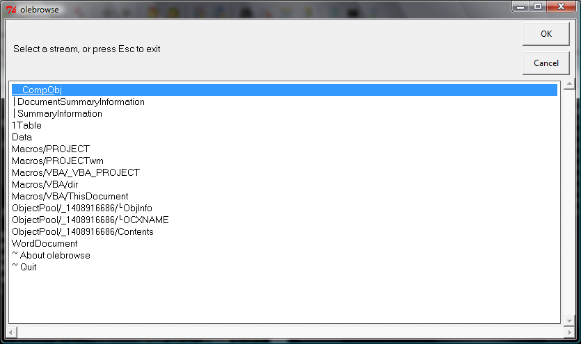
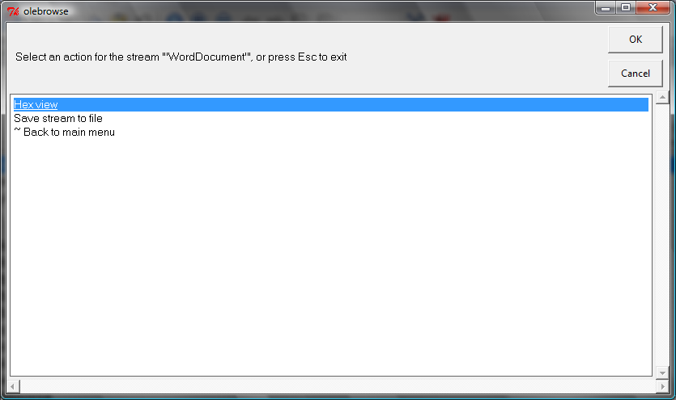
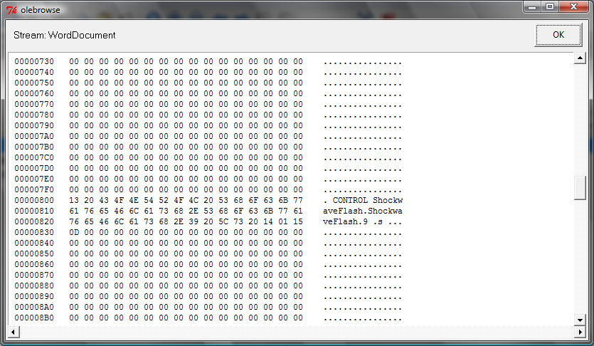

olebrowse
=========

olebrowse is a simple GUI to browse OLE files (e.g. MS Word, Excel, Powerpoint documents), to
view and extract individual data streams.

It is part of the [python-oletools](http://www.decalage.info/python/oletools) package.

Dependencies
------------

olebrowse requires [Tkinter](https://en.wikipedia.org/wiki/Tkinter).
On Windows and MacOSX, it should be installed with Python, and
olebrowse should work out of the box.

However, on Linux it might be necessary to install the tkinter
package for Python separately. For example, on Ubuntu this is done with the
following command:

```
sudo apt-get install python-tk
```

And for Python 3:

```
sudo apt-get install python3-tk
```


Usage
-----
```
olebrowse [file]
```
If you provide a file it will be opened, else a dialog will allow you to browse
folders to open a file. Then if it is a valid OLE file, the list of data streams
will be displayed. You can select a stream, and then either view its content
in a builtin hexadecimal viewer, or save it to a file for further analysis.

Screenshots
-----------

Main menu, showing all streams in the OLE file:



Menu with actions for a stream:



Hex view for a stream:



--------------------------------------------------------------------------

python-oletools documentation
-----------------------------

- [[Home]]
- [[License]]
- [[Install]]
- [[Contribute]], Suggest Improvements or Report Issues
- Tools:
	- [[mraptor]]
	- [[msodde]]
	- [[olebrowse]]
	- [[oledir]]
	- [[oleid]]
	- [[olemap]]
	- [[olemeta]]
	- [[oleobj]]
	- [[oletimes]]
	- [[olevba]]
	- [[pyxswf]]
	- [[rtfobj]]
