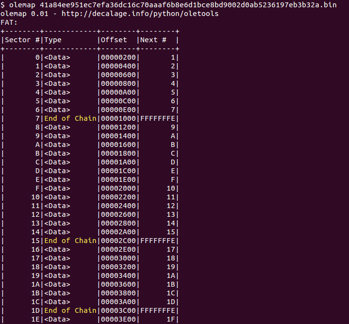
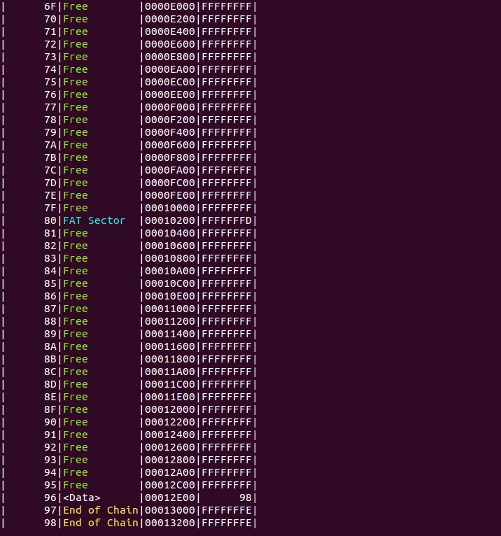

olemap
======

olemap is a script to display a map of all the sectors in an OLE file.

It can be used either as a command-line tool, or as a python module from your own applications.

It is part of the [python-oletools](http://www.decalage.info/python/oletools) package.

## Usage

```text
Usage: olemap <filename>
```

### Examples

Scan a single file:

```text
olemap file.doc
```
    




--------------------------------------------------------------------------
    
## How to use olemap in Python applications

TODO

--------------------------------------------------------------------------

python-oletools documentation
-----------------------------

- [[Home]]
- [[License]]
- [[Install]]
- [[Contribute]], Suggest Improvements or Report Issues
- Tools:
	- [[mraptor]]
	- [[msodde]]
	- [[olebrowse]]
	- [[oledir]]
	- [[oleid]]
	- [[olemap]]
	- [[olemeta]]
	- [[oleobj]]
	- [[oletimes]]
	- [[olevba]]
	- [[pyxswf]]
	- [[rtfobj]]
